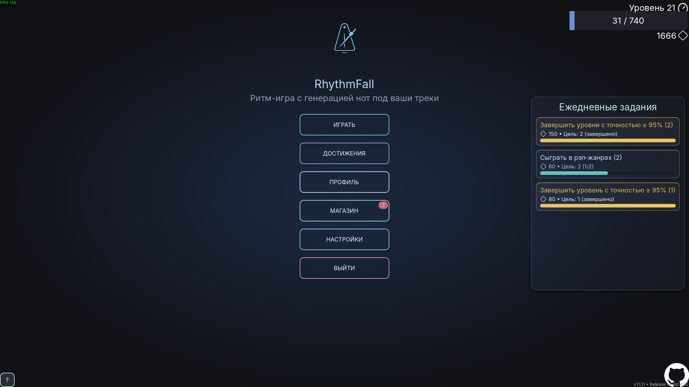
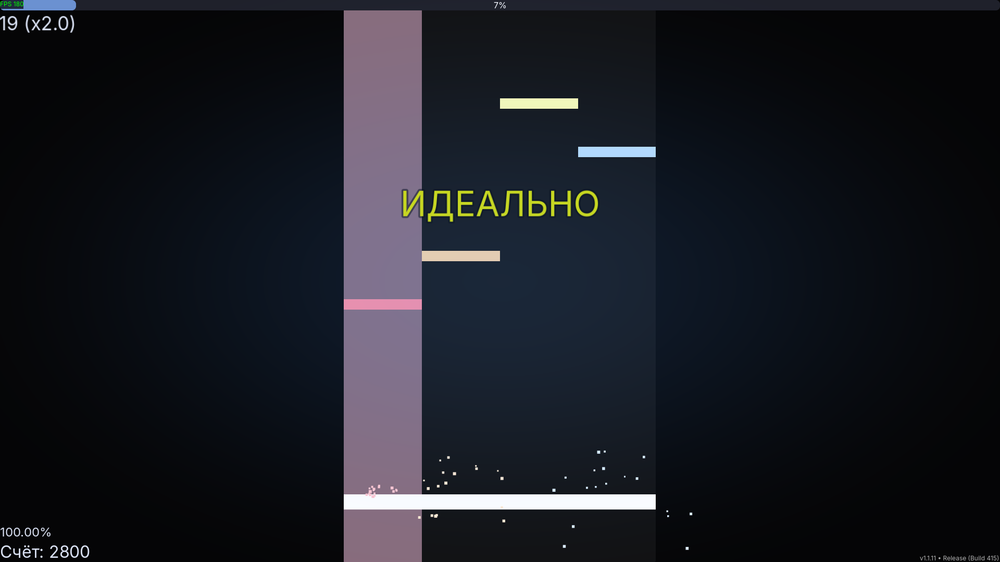
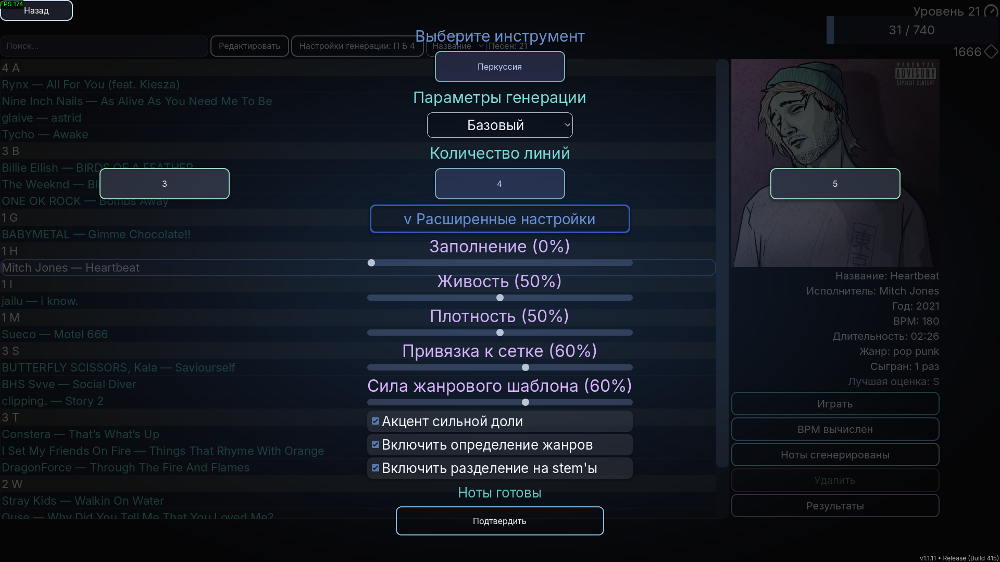
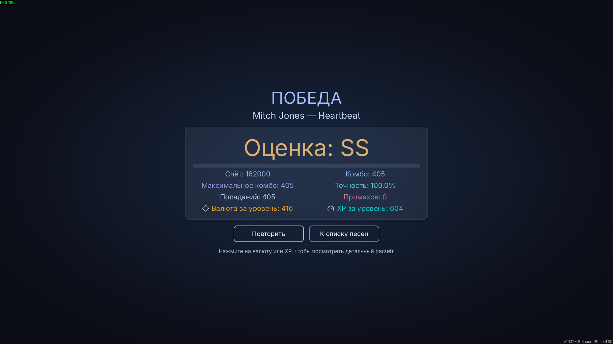
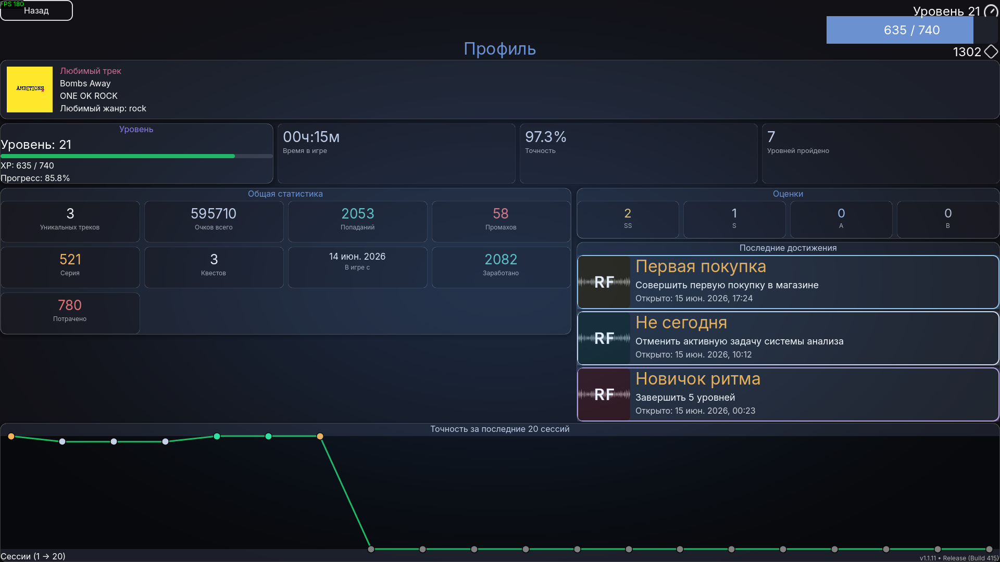

# RhythmFall

Turn your own music into playable rhythm‑game levels. The project focuses on fully local, automatic note generation from audio — no manual charting required.

Note: This repository contains the Godot client. For the server (audio analysis and note generation), use RhythmFallServer: https://github.com/abletoburntheweb/RhythmFallServer

Languages: English | [Русский](./README.ru.md)

## What It Is
RhythmFall is a Godot‑based rhythm game that analyzes any track you choose and builds a playable note chart on the fly. A lightweight local server handles audio analysis and returns notes to the game.

## How It Works
- The Godot client sends a selected song to a local Python server.
- The server estimates tempo and drum events, applies genre‑aware patterns, and generates a chart.
- The client saves the chart locally and you can play immediately.

## Key Features

**Core gameplay**
- Automatic note generation from audio (no manual charting)
- Drum-focused patterns: minimal, basic, enhanced, natural, and custom modes
- 3–5 lanes, genre-aware density and groove, optional stem separation
- Letter grades (SS through C), combo, accuracy, XP and currency rewards
- Audio-driven timing; calibration in Settings

**Song library**
- Import your own tracks; bundled songs included
- BPM analysis and per-track note generation via the local server
- Metadata editing (title, artist, year, genre, BPM), per-song results history
- Delete user-added tracks from the library (bundled songs stay protected)

**Progression and meta**
- Player level and XP; in-game currency (diamonds)
- **Shop** — unlockable covers, themes, and cosmetics; rewards from levels, achievements, and daily quests
- **Achievements** — track milestones across gameplay, library, and stats
- **Daily quests** on the main menu — short goals with currency rewards
- **Profile** — favorite track, stats dashboard, grade tiles, accuracy chart, recent sessions

**Menus and settings**
- Main menu hub: play, shop, achievements, profile, settings, help
- **Settings** — sound, graphics, controls, misc (generation server host/port, data reset)
- **Help** — scrollable guide with Getting Started onboarding (content editable via JSON)

**Technical**
- Fully local workflow for analysis and generation (localhost or LAN server)
- Windows installer and portable build since v1.1.10

## Screenshots

| Main menu | Gameplay |
| --- | --- |
|  |  |

| Song library & generation | Victory |
| --- | --- |
|  |  |

| Profile |
| --- |
|  |

## Quick Start
- Start the local server ([RhythmFallServer](https://github.com/abletoburntheweb/RhythmFallServer)).
- Launch the Godot client and open the game.
- Generate notes: choose drums, mode (basic/enhanced), and lanes; pick a song.
- Play the newly generated level.

## Windows download

Pre-built Windows builds are available since **v1.1.10** (installer and optional portable ZIP) — no Godot editor required.

Download the latest **`RhythmFall-*-setup.exe`** from [GitHub Releases](https://github.com/abletoburntheweb/RhythmFall/releases) (currently **v1.1.11**). A portable ZIP (folder with `RhythmFall.exe`) may also be provided for the same version.

**Install:** run setup.exe → choose a folder (default: Program Files or Local Programs) → Start menu shortcut, optional desktop icon.

**Uninstall after setup:** Settings → Apps → RhythmFall → **Uninstall** (or “Uninstall RhythmFall” in the Start menu). Windows runs the installer’s own uninstaller — it removes game files from the install folder and deletes shortcuts. It then asks whether to delete saves in `%APPDATA%\RhythmFall\` (default: keep them). `Uninstall-RhythmFall.bat` is not included in the setup; it is only for the portable ZIP.

**Saves and settings** live outside the install folder: `%APPDATA%\RhythmFall\` (progress, generated notes, shop purchases, etc.). Installing a newer setup.exe over an older install keeps your saves.

**Note generation still requires the local Python server** — the downloadable client is the game only.

## Notes
- Your music stays on your machine and is not part of the repository.
- Analysis and generation run locally; tracks are not uploaded anywhere.
- Output quality depends on mix and genre; the enhanced mode is more accurate but slower.
- Stems can improve drum detection but significantly increase processing time — disable for quick tests.
- Common audio formats are supported; niche codecs may have limitations.
- For pipeline details and advanced configuration, refer to the server repository.
