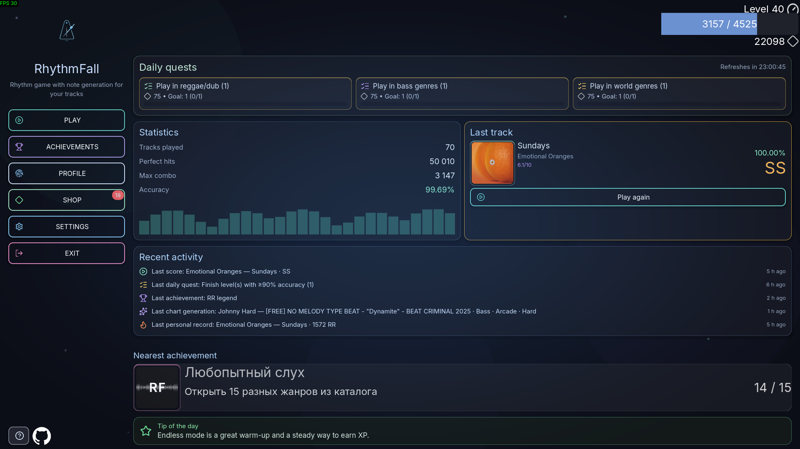
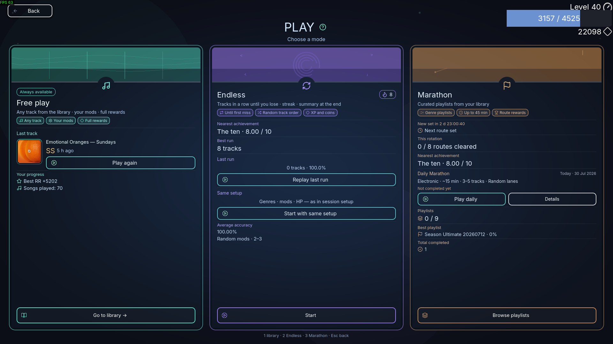
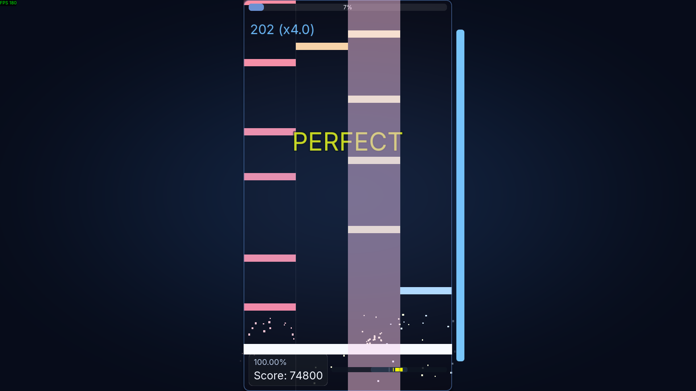
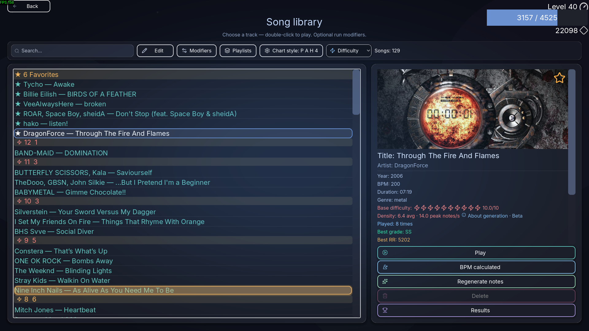
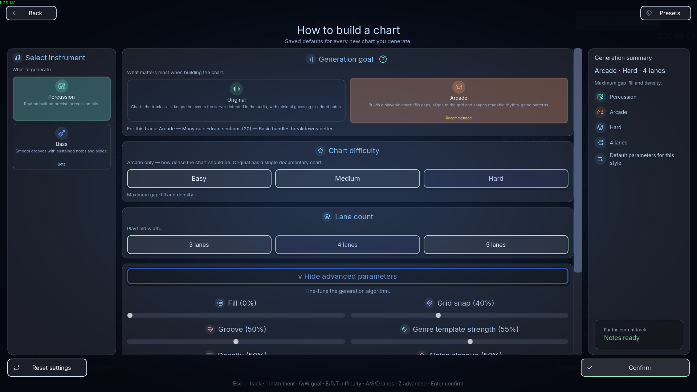
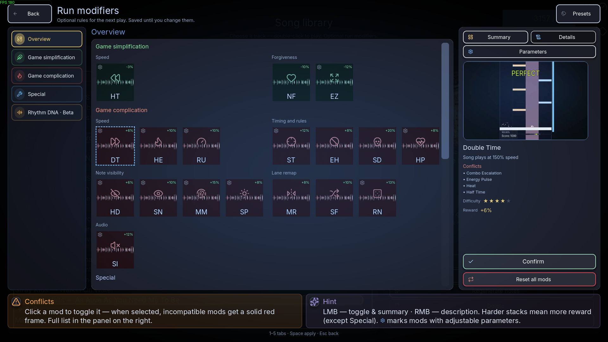
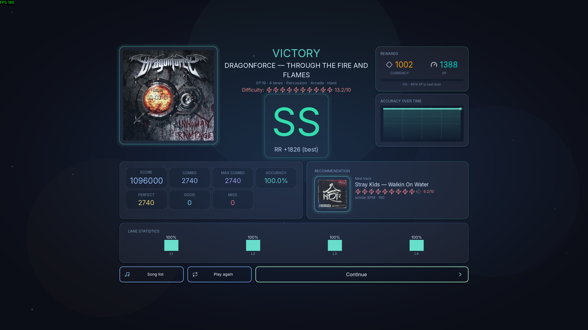
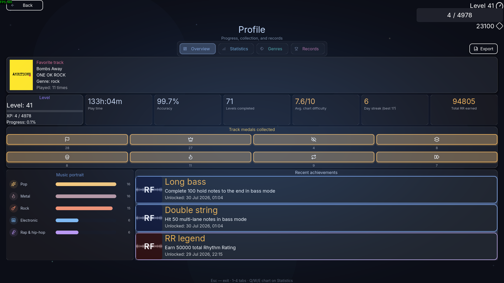

# RhythmFall

Turn your own music into playable rhythm-game levels. Fully local automatic note generation from audio — no manual charting required.

Note: This repository contains the Godot **client**. For the server (audio analysis and note generation), see [RhythmFallServer](https://github.com/abletoburntheweb/RhythmFallServer).

Languages: English | [Русский](./README.ru.md)

## What It Is

RhythmFall is a Godot-based rhythm game that analyzes tracks from your library and builds playable charts on the fly. A local **RhythmFallServer** handles BPM, genres, optional stem separation, and chart generation, then returns notes to the game. Pick a song, tune a few options, and play.

Since **v1.2.0**, the Windows installer can bundle that server next to the game (Python venv + models), so analysis works offline without extra setup. Development builds can still point at a separate server checkout.

## How It Works

- You choose a song, instrument (**Drums** or **Bass** beta), chart **goal** (Original / Arcade), lane count (3–5), and optional run modifiers.
- The Godot client talks to **RhythmFallServer** on your machine (localhost or LAN).
- The server estimates tempo, detects hits, applies goal-aware policies, and writes human-readable **`.rf`** charts (plus **`.rfd`** Rhythm DNA sidecars for drums).
- **Original** — one documentary chart per instrument (`drums_original.rf`). **Arcade** — Easy / Medium / Hard density tiers (`drums_arcade_*.rf`).
- Charts live under your notes folder; progress, medals, grades, XP, currency, and **Rhythm Rating (RR)** persist in `%APPDATA%\RhythmFall\`.

## Key Features

**Core gameplay**

- Automatic note generation from audio — no manual charting
- Falling-lane gameplay with audio-driven timing and calibration in Settings
- **Original / Arcade** chart goals; Arcade keeps Easy / Medium / Hard
- **Bass mode (beta)** — tap / hold / slide charts from a bass stem
- **3–5 lanes**, genre-aware density, optional stem separation
- Letter grades (SS–F), combo, accuracy, XP and currency rewards
- **Health bar** — misses drain HP; good hits restore a little; run ends at zero HP unless No Fail is on
- **36 run modifiers** — easing, hardening, special rules, and **Rhythm DNA** mods (need `.rfd`); reward multiplier before play
- Optional **3 s resume rewind** on pause and Last Chance
- Decimal **chart difficulty** (e.g. 7.4/10) with live effective rating when modifiers are active
- **Rhythm Rating (RR)** — per-track scoring for competitive runs

**Play modes**

- **Library** — song select: filters, medals, generation queue, per-track history
- **Endless** — multi-track series from a random pool or playlist; streaks, XP/coins (no series RR)
- **Marathon** — fixed routes (eight rotation archetypes + daily), duration-first builder, route badges; unlock at player level 22

**Song library & generation**

- Import your own tracks; bundled songs included
- BPM analysis and per-track note generation via the local server
- Rich filters: title, artist, year, BPM, duration, difficulty, notes-ready, most played
- **Genre picker** — EffNet top-5 suggestions plus searchable 200-tag catalog
- **Generation queue** (StatusDock) — FIFO jobs, cancel / promote / demote, style chips per track
- **Eight medals per track** — unlock shop cosmetics (medals are collected, not spent)
- Metadata editing, per-song results history with active modifiers
- Confirmations before recalculating BPM or regenerating notes
- Track preview — 15 s highlight or full track; dedupe when adding songs
- **Rhythm DNA** dialog after drum bake; in-game generation QA (**F10**)

**Progression & meta**

- Player level and XP; in-game currency (diamonds)
- **Shop** — kicks, covers, note palettes, lane highlights, **hit particles**
- **165 achievements** — gameplay, modifiers, play modes, genres, RR, generation, and more
- **Daily quests** on the main menu
- **Profile** — Overview, Statistics, Genres (15 collections / 200 tags), Records
- **Recap share** — five PNG cards + HTML export

**Menus & settings**

- Full **English and Russian** UI; keyboard navigation on major screens
- Main menu hub → play modes, shop, achievements, profile, settings, help
- **Nine settings pages** — sound, graphics, controls, system, generation, library, data, experimental, danger zone
- Ambient menu backgrounds; redesigned help with flows, showcases, and **F1** from pause
- **Guitar Hero** controller preset (XInput)

**Technical**

- Fully local — music is not uploaded
- **`.rf`** charts (RFC v1) + **`.rfd`** DNA sidecars for drums; legacy stem names still load
- Chart A/B compare and timing debug (experimental)
- Windows **installer and portable ZIP**; **v1.2.0** can ship the generation server in the payload (~4–5 GB with venv)
- Auto-managed worker on port 5000; GPU stems optional (CUDA / DirectML / CPU); **ffmpeg** required for stems

## Screenshots

| Main menu | Play modes |
| --- | --- |
|  |  |

| Gameplay | Song library |
| --- | --- |
|  |  |

| Generation | Modifiers |
| --- | --- |
|  |  |

| Victory | Profile |
| --- | --- |
|  |  |

## Quick Start

**If you downloaded the game**

1. Run `RhythmFall.exe` (or install via setup.exe first).
2. Open **Settings → Generation** — with the bundled server (v1.2.0+), choose **Auto**; otherwise start [RhythmFallServer](https://github.com/abletoburntheweb/RhythmFallServer) separately and set host/port.
3. Add or pick a song, choose instrument + goal (+ Arcade difficulty) + lanes, generate notes.
4. Play — or open **Play modes** for Endless / Marathon.

**For development**

1. Clone this repo and [RhythmFallServer](https://github.com/abletoburntheweb/RhythmFallServer) into `RhythmFallServer/` (sibling of `worker/`).
2. `powershell -ExecutionPolicy Bypass -File worker\install_windows_server.ps1 -Gpu auto`
3. `powershell -ExecutionPolicy Bypass -File worker\download_effnet_models.ps1`
4. `powershell -ExecutionPolicy Bypass -File worker\build_server_launcher.ps1`
5. Open the project in Godot 4, run, or export — see `RFALL/BUILD.txt`.

## Windows download

Pre-built Windows builds are available since **v1.1.10** (installer and portable ZIP) — no Godot editor required.

Download the latest **`RhythmFall-*-setup.exe`** from [GitHub Releases](https://github.com/abletoburntheweb/RhythmFall/releases) (currently **v1.2.0**). A portable ZIP may also be provided for the same version.

**Install:** run setup.exe → choose a folder → Start menu shortcut, optional desktop icon. The installer registers Explorer icons for `.rf` / `.rfd` (per-user). It does **not** install Python or ask about GPU — a release build already embeds a prepared server venv.

**Uninstall:** Settings → Apps → RhythmFall → **Uninstall**. Removes the install folder (including bundled server venv on v1.2.0+). Optionally deletes saves in `%APPDATA%\RhythmFall\` and `%APPDATA%\Godot\app_userdata\RhythmFall\` (default: keep saves).

**Saves and settings** live outside the install folder: `%APPDATA%\RhythmFall\`. Installing a newer setup.exe over an older install keeps your progress.

**Portable ZIP:** unzip and run `RhythmFall.exe`; use `Uninstall-RhythmFall.bat` only for folder-only removal (not used by the installer).

**Build from source:** `RFALL/BUILD.txt` — Godot export, copy `worker/` + `RhythmFallServer/` (with `.venv`) + `RhythmFallServer.exe` into the export folder, then `RFALL\build-installer.bat`.

## Notes

- Your music stays on your machine; analysis runs locally (localhost or LAN).
- Autoplay earns no XP/currency and does not save results.
- Output quality depends on mix and genre; Arcade styles and stem separation are more accurate but slower.
- GPU and ADTOF are optional — CPU fallback works; first stem separation is slower on CPU.
- Python **3.9–3.11** recommended when building the server venv yourself.
- Pipeline details: [RhythmFallServer](https://github.com/abletoburntheweb/RhythmFallServer). Client release notes: [`CHANGELOG.md`](CHANGELOG.md).
