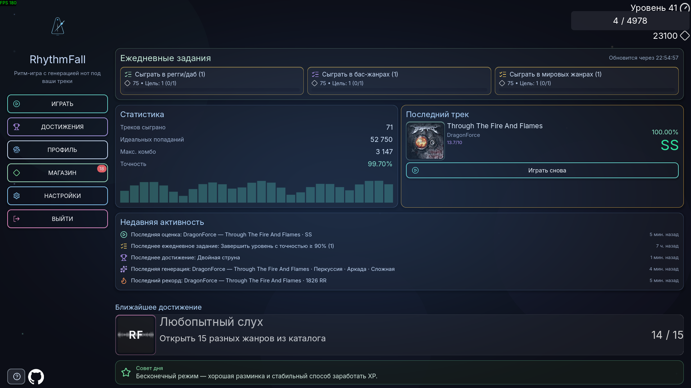
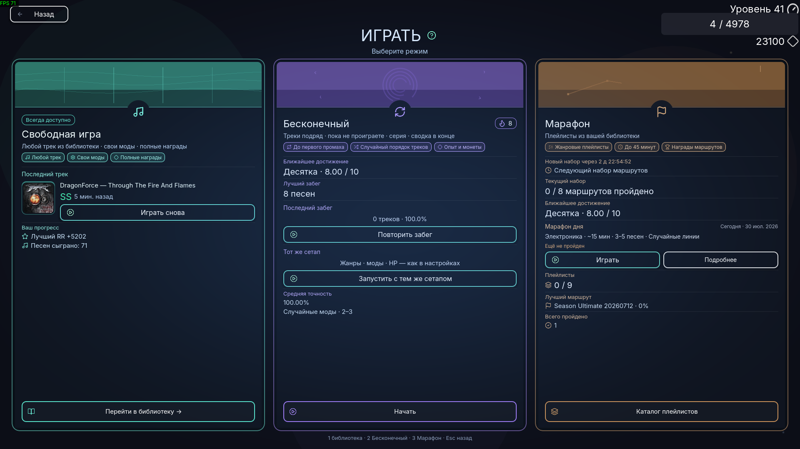
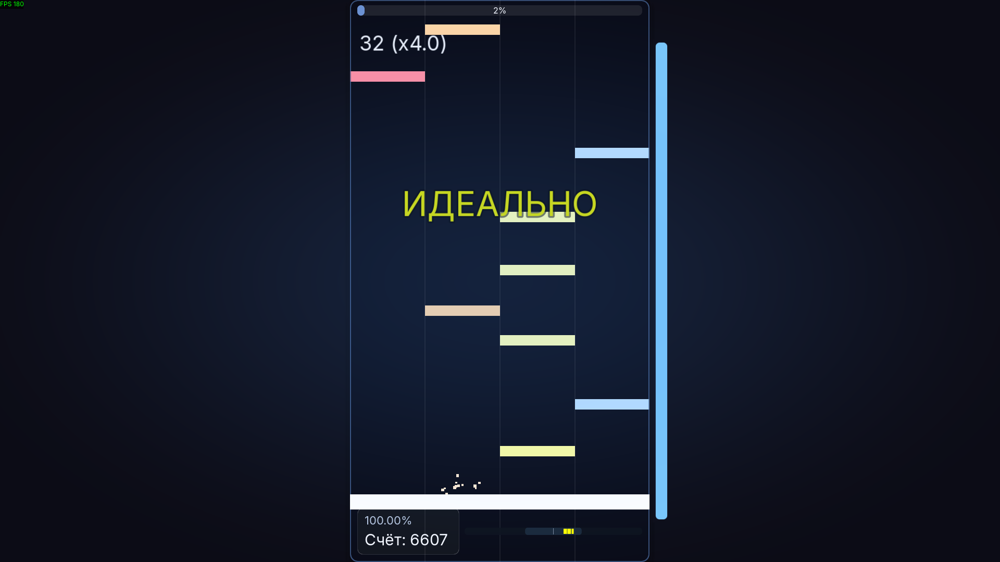
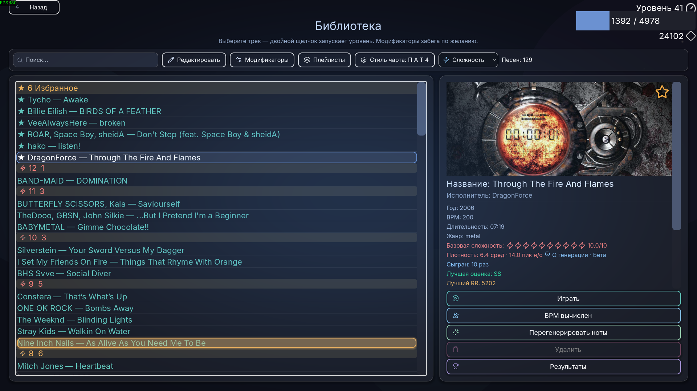
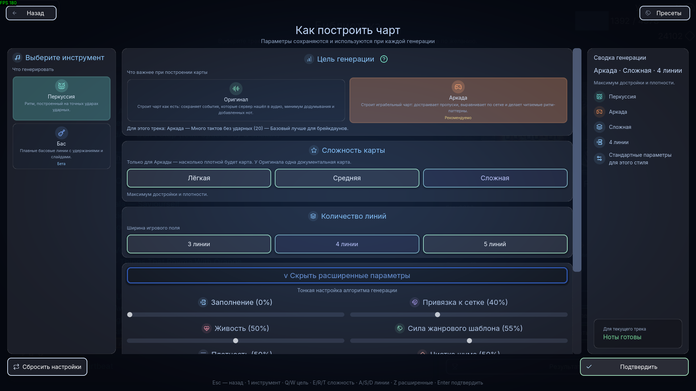
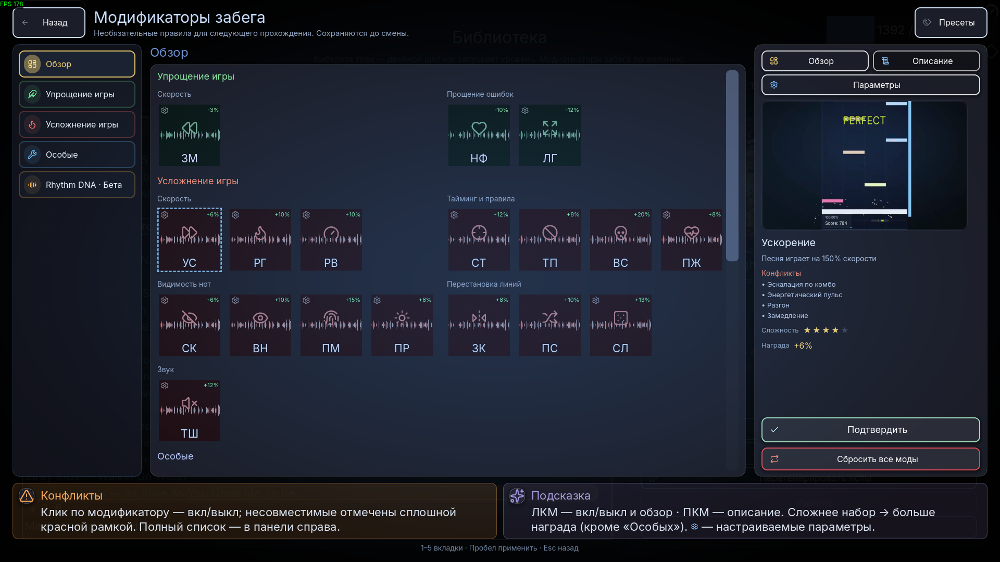
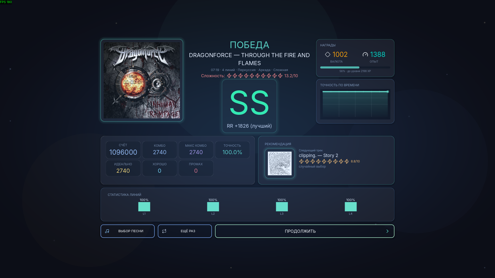
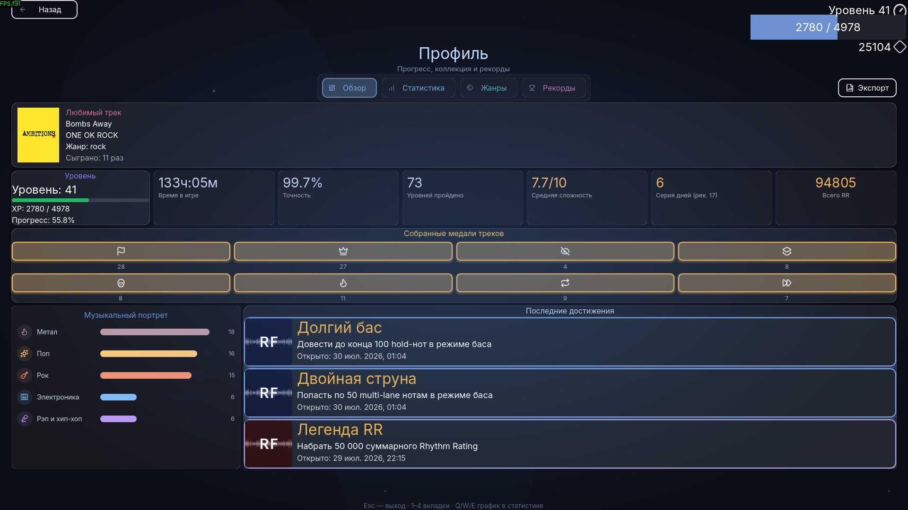

# RhythmFall

Преобразует вашу музыку в уровни ритм-игры. Полностью локальная автоматическая генерация нот — без ручного маппинга.

Примечание: в этом репозитории — **клиент** Godot. Сервер (анализ аудио и генерация нот): [RhythmFallServer](https://github.com/abletoburntheweb/RhythmFallServer).

Языки: [English](./README.md) | Русский

## Что это

RhythmFall — ритм-игра на Godot: анализирует треки из вашей библиотеки и на лету строит играбельные чарты. Локальный **RhythmFallServer** делает BPM, жанры, опционально стемы и генерацию нот, затем отдаёт результат в игру. Выбираете песню, настраиваете параметры и играете.

С **v1.2.0** установщик Windows может включать этот сервер рядом с игрой (Python venv + модели), чтобы анализ работал офлайн без отдельной настройки. В dev-сборке по-прежнему можно подключать отдельный checkout сервера.

## Как это работает

- Вы выбираете песню, инструмент (**Ударные** или **Бас** бета), **цель** чарта (Оригинал / Аркада), число дорожек (3–5) и опциональные модификаторы.
- Клиент Godot общается с **RhythmFallServer** на вашем ПК (localhost или LAN).
- Сервер оценивает темп, находит удары, применяет политику цели и пишет читаемые **`.rf`** (плюс sidecar **`.rfd`** Rhythm DNA для ударных).
- **Оригинал** — один документальный чарт (`drums_original.rf`). **Аркада** — Лёгкая / Средняя / Сложная (`drums_arcade_*.rf`).
- Чарты лежат в папке нот; прогресс, медали, грейды, XP, валюта и **Rhythm Rating (RR)** — в `%APPDATA%\RhythmFall\`.

## Ключевые возможности

**Геймплей**

- Автогенерация нот из аудио — без ручной разметки
- Падающие дорожки, синхронизация с аудио, калибровка в настройках
- Цели **Оригинал / Аркада**; у Аркады — Лёгкая / Средняя / Сложная
- **Бас (бета)** — tap / hold / slide по bass-stem
- **3–5 дорожек**, учёт жанра, опциональные стемы
- Оценки SS–F, комбо, точность, XP и валюта
- **Полоска HP** — промахи отнимают здоровье; при нуле HP забег заканчивается, если не включён No Fail
- **36 модификаторов** — облегчение, усложнение, особые правила и **Rhythm DNA** (нужен `.rfd`); множитель награды перед стартом
- Опциональная **перемотка 3 с** при паузе и Last Chance
- **Десятичная сложность** (например 7.4/10) с live-рейтингом при модах
- **Rhythm Rating (RR)** — оценка за трек

**Режимы игры**

- **Библиотека** — выбор песен: фильтры, медали, очередь генерации, история
- **Бесконечный (Endless)** — серия из пула или плейлиста; серии, XP/монеты (без series RR)
- **Марафон** — фиксированные маршруты (8 архетипов + daily), билдер по длительности, медали маршрутов; разблокировка с 22 уровня

**Библиотека и генерация**

- Свои треки + bundled songs
- BPM и генерация нот через локальный сервер
- Фильтры: название, артист, год, BPM, длительность, сложность, готовность нот, чаще играли
- **Выбор жанра** — топ-5 EffNet + каталог из 200 тегов
- **Очередь генерации** (StatusDock) — FIFO, отмена / приоритет, чипы стилей
- **Восемь медалей на трек** — открывают косметику в магазине (не тратятся)
- Метаданные, история результатов с модами
- Подтверждение перед повторным BPM или регенерацией
- Превью — 15 с или весь трек; защита от дублей
- Диалог **Rhythm DNA** после bake ударных; QA генерации (**F10**)

**Прогресс и мета**

- Уровень и XP; валюта (алмазы)
- **Магазин** — кики, обложки, палитры, подсветка линий, **частицы хита**
- **165 достижений**
- **Ежедневные задания** на главном меню
- **Профиль** — Обзор, Статистика, Жанры (15 / 200), Рекорды
- **Recap** — пять PNG + HTML-экспорт

**Меню и настройки**

- Полный UI **EN / RU**; горячие клавиши на основных экранах
- Главное меню → режимы, магазин, достижения, профиль, настройки, справка
- **Девять страниц настроек**
- Ambient-фоны; справка с flow/showcase и **F1** с паузы
- Пресет **Guitar Hero** (XInput)

**Технически**

- Полностью локальный пайплайн
- **`.rf`** (RFC v1) + **`.rfd`** для ударных; legacy-имена читаются
- Compare чартов A/B и timing debug (experimental)
- **Установщик + portable ZIP**; **v1.2.0** может включать сервер в payload (~4–5 GB с venv)
- Автоворкер на порту 5000; GPU опционально (CUDA / DirectML / CPU); для стемов нужен **ffmpeg**

## Скриншоты

| Главное меню | Режимы игры |
| --- | --- |
|  |  |

| Геймплей | Библиотека |
| --- | --- |
|  |  |

| Генерация | Модификаторы |
| --- | --- |
|  |  |

| Победа | Профиль |
| --- | --- |
|  |  |

## Быстрый старт

**Если скачали готовую сборку**

1. Запустите `RhythmFall.exe` (или сначала установите через setup.exe).
2. **Настройки → Генерация** — с bundled-сервером (v1.2.0+) выберите **Автоматически**; иначе запустите [RhythmFallServer](https://github.com/abletoburntheweb/RhythmFallServer) отдельно и укажите host/port.
3. Добавьте или выберите песню, инструмент + цель (+ сложность Аркады) + дорожки, сгенерируйте ноты.
4. Играйте — или откройте **Режимы игры** для Endless / Марафона.

**Для разработки**

1. Клонируйте репозиторий и [RhythmFallServer](https://github.com/abletoburntheweb/RhythmFallServer) в `RhythmFallServer/` (рядом с `worker/`).
2. `powershell -ExecutionPolicy Bypass -File worker\install_windows_server.ps1 -Gpu auto`
3. `powershell -ExecutionPolicy Bypass -File worker\download_effnet_models.ps1`
4. `powershell -ExecutionPolicy Bypass -File worker\build_server_launcher.ps1`
5. Откройте проект в Godot 4, запустите или экспортируйте — см. `RFALL/BUILD.txt`.

## Скачивание для Windows

Готовые сборки для Windows доступны с **v1.1.10** (установщик и portable ZIP) — редактор Godot не нужен.

Актуальный **`RhythmFall-*-setup.exe`** — в [GitHub Releases](https://github.com/abletoburntheweb/RhythmFall/releases) (сейчас **v1.2.0**). Для той же версии может быть и portable ZIP.

**Установка:** setup.exe → папка → ярлык в Пуск, опционально на рабочий стол. Установщик регистрирует иконки `.rf` / `.rfd` в Explorer (на пользователя). Он **не** ставит Python и **не** спрашивает про GPU — в релиз уже кладётся готовый venv сервера.

**Удаление:** Параметры → Приложения → RhythmFall → **Удалить**. Сносит папку установки (включая venv на v1.2.0+). Отдельно спросит про сохранения в `%APPDATA%\RhythmFall\` (по умолчанию — оставить).

**Сохранения** вне папки игры: `%APPDATA%\RhythmFall\`. Обновление поверх старой версии прогресс не трогает.

**Portable ZIP:** распаковать и запустить `RhythmFall.exe`; `Uninstall-RhythmFall.bat` только для portable.

**Сборка из исходников:** `RFALL/BUILD.txt` — export Godot, скопировать `worker/` + `RhythmFallServer/` (с `.venv`) + `RhythmFallServer.exe` в папку экспорта, затем `RFALL\build-installer.bat`.

## Примечания

- Музыка остаётся на вашем ПК; анализ локальный.
- Autoplay не даёт XP/валюту и не сохраняет результат.
- Качество зависит от микса и жанра; Аркада и стемы точнее, но медленнее.
- GPU и ADTOF опциональны — есть CPU fallback.
- Для сборки venv сервера рекомендуется Python **3.9–3.11**.
- Пайплайн: [RhythmFallServer](https://github.com/abletoburntheweb/RhythmFallServer). Changelog клиента: [`CHANGELOG.md`](CHANGELOG.md).
